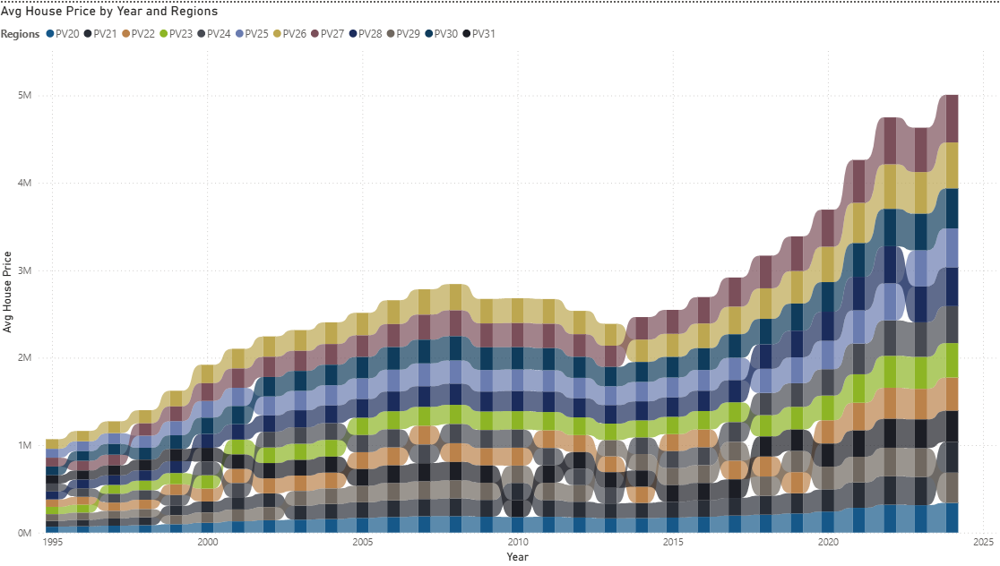

# Dutch Housing Price Analysis (1995–2023)

## Project Overview
This project analyzes long-term trends in **Dutch housing prices from 1995 to 2023** using **Power BI** and **Python**, based on publicly available CBS housing data.

The analysis examines housing price evolution across multiple geographic levels:
- National  
- Macroregion  
- Province  
- Municipality  

The objective is to understand **long-term price growth, regional disparities, volatility, and emerging growth patterns** in the Dutch housing market.

---

## Business Questions
- How have Dutch house prices evolved over the last 30 years?
- How do housing price trends differ across regions, provinces, and municipalities?
- Which areas experienced the fastest growth versus the highest price levels?
- How do growth and volatility differ across provinces?
- Do high-growth areas always correspond to high-price areas?

---

## Analytical Approach
- Data cleaning and preprocessing  
- Feature engineering (year extraction, region classification)  
- Time-series trend analysis  
- National, regional, provincial, and municipal comparisons  
- Growth, volatility, and cumulative growth analysis  
- Scatter analysis to compare price levels, growth, and stability  

---

## Key Analyses & Visuals
- National house price trend (1995–2023)
- Year-on-year (YoY) growth analysis
- Macroregional housing price comparisons
- Provincial price trends and rankings
- Province-level growth vs volatility scatter analysis
- Municipality-level price comparisons (most expensive vs cheapest)
- Cumulative national housing price growth
- KPI cards highlighting:
  - Latest national price
  - Total growth since 1995
  - Most expensive province

---

## Key Insights
- Dutch house prices show a **strong long-term upward trend**, with clear cyclical phases.
- The 2008 financial crisis and post-2013 recovery are clearly visible in national trends.
- **Significant regional disparities** persist across macroregions and provinces.
- Provinces with the fastest growth are **not always the most expensive**.
- Higher growth is often associated with **higher volatility**, especially at the provincial level.
- National or provincial averages can mask large **municipality-level differences**.

---

## Tools Used
- **Power BI**  
  - Data modeling  
  - DAX measures  
  - Interactive dashboards and KPI visuals  

- **Python**  
  - pandas  
  - numpy  
  - matplotlib  
  - seaborn  

- **GitHub**  
  - Version control  
  - Project documentation  

---

## How to Use
1. Clone or download the repository  
2. Open `powerbi/Dutch_Housing.pbix` in Power BI Desktop  
3. Ensure `housing.csv` is available in the correct path  
4. Refresh data if needed  
5. Explore the interactive dashboards and insights  
